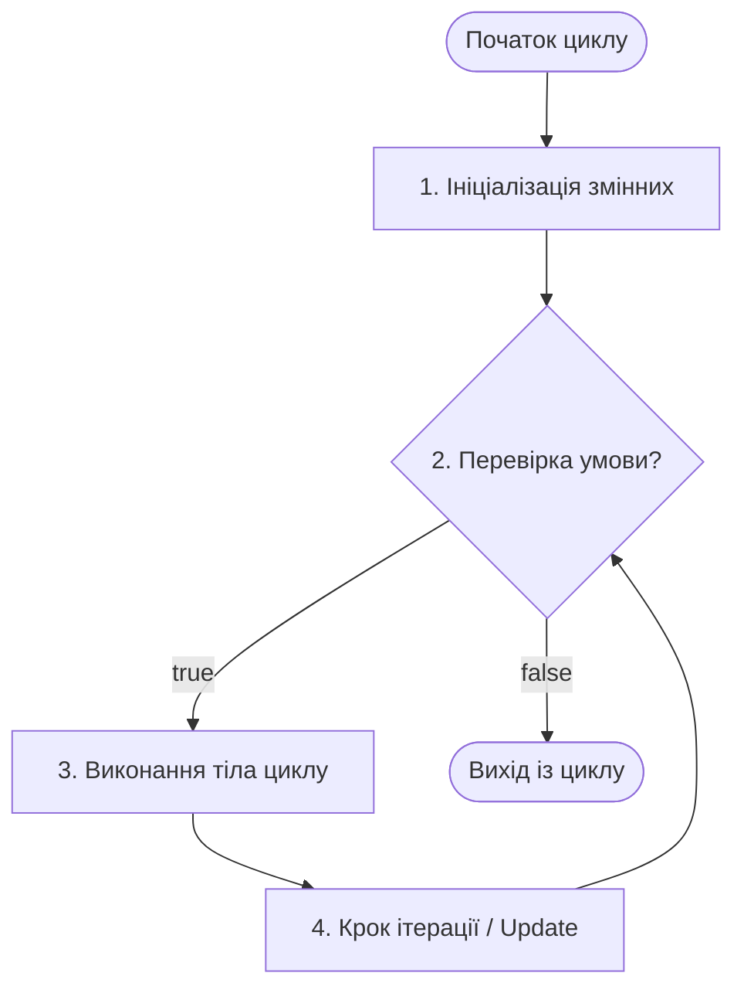
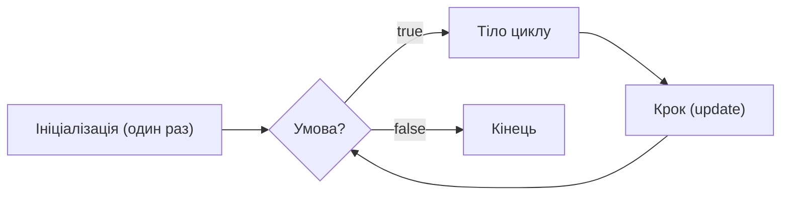

# Практична робота №4: Цикли (while, do-while, for), усунення надлишковості коду та приведення типів у Java

## 🎯 Мета роботи
- **Зрозуміти фундаментальну концепцію циклів:** розібрати анатомію циклічного процесу (ініціалізація, умова, ітерація, крок) та навчитися керувати повторюваними діями в програмах.
- **Усвідомити проблему надлишковості коду (Code Redundancy):** опанувати принцип **DRY** (*Don't Repeat Yourself*) та навчитися замінювати неефективний копіпаст гнучкими алгоритмічними конструкціями.
- **Опанувати цикл із передумовою `while`:** вивчити синтаксис, сценарії використання, коли кількість повторень наперед невідома, та уникати пастки зациклення (*infinite loop*).
- **Опанувати цикл із постумовою `do-while`:** зрозуміти ключову відмінність (гарантоване виконання хоча б 1 раз), навчитися застосовувати його для створення діалогових меню та валідації введених користувачем даних.
- **Опанувати класичний цикл із лічильником `for`:** розібрати три складові заголовка циклу, зворотний хід, кастомний крок лічильника, а також керуючі інструкції переривання та переходу: `break` і `continue`.
- **Глибоко засвоїти приведення типів (Type Casting):**
  - Неявне розширення типу (*Widening / Upcasting*): `byte` $\to$ `short` $\to$ `int` $\to$ `long` $\to$ `float` $\to$ `double`.
  - Явне звуження типу (*Narrowing / Downcasting*): синтаксис `(тип) значення`, відкидання дробової частини та небезпека переповнення розрядної сітки (*Overflow / Underflow*).
  - Арифметика з символами `char` та числовими кодами Unicode/ASCII.
  - Пастка цілочисельного ділення та способи отримання точного дробового результату.
- **Засвоїти відповіді на ключові питання (Q&A):** підводні камені під час проходження співбесід і тестування.
- **Розв'язати 40 практичних завдань:** закріпити отримані знання написанням реального коду.

---

## 📚 1. Теоретичні відомості

### 1.1. Що таке цикли? (Анатомія циклічного процесу)

У реальному світі більшість процесів є повторюваними: щоденний дзвінок будильника, нарахування відсотків на банківський депозит щомісяця, обробка кожного товару у чеку покупця.

> **Цикл (Loop)** — це синтаксична конструкція мови програмування, яка забезпечує багаторазове виконання певної послідовності команд (інструкцій) доти, доки залишається істинною задана логічна умова.

#### Анатомія будь-якого циклу складається з 4-х обов'язкових елементів:
1. **Початковий стан (Initialization):** оголошення або встановлення змінної-лічильника / стану перед початком виконання циклу.
2. **Умова повторення (Loop Condition):** булевий вираз (`true` / `false`). Якщо умова істинна — виконується чергове повторення. Щойно умова повертає `false` — виконання циклу негайно припиняється.
3. **Тіло циклу (Loop Body):** блок коду у фігурних дужках `{}`, який містить корисні дії програми, що мають повторюватися.
4. **Крок ітерації (Update / Step):** операція, яка змінює стан лічильника на кожному кроці, наближаючи момент, коли умова завершення стане хибною (`false`).



> [!NOTE]
> **Ітерація (Iteration)** — це один окремий прохід тіла циклу. Наприклад, якщо повідомлення було виведено 10 разів, цикл здійснив 10 ітерацій.

---

### 1.2. Надлишковість (Code Redundancy) та принцип DRY

Уявіть завдання: вивести на екран рядок `"Привіт, світе!"` 5 разів. Початківець може написати так:

```java
// ПОГАНО: Надлишковий код (Code Redundancy / Copy-Paste)
System.out.println("Привіт, світе!");
System.out.println("Привіт, світе!");
System.out.println("Привіт, світе!");
System.out.println("Привіт, світе!");
System.out.println("Привіт, світе!");
```

А тепер уявіть, що:
1. Клієнт просить вивести цей рядок **1 000 разів** або **1 000 000 разів**. Копіювати рядок мільйон разів фізично неможливо.
2. Замовник вирішив замінити текст на `"Привіт, Україно!"`. Вам доведеться вручну відредагувати кожне окреме місце копіпасту. Якщо ви забудете змінити хоча б один рядок — у коді виникне баг розсинхронізації.
3. Кількість повторень $N$ визначається **динамічно** (користувач вводить її з консолі під час роботи програми).

> [!IMPORTANT]
> **Принцип DRY (Don't Repeat Yourself — «Не повторюйся»):**
> Кожен фрагмент знання або логіки в системі повинен мати єдине, однозначне та авторитетне представлення. Дублювання коду — головне джерело прихованих помилок та труднощів у підтримці програмного забезпечення.

Завдяки циклу код стає компактним, елегантним і легко масштабованим:
```java
// ДОБРЕ: Код без надлишковості
for (int i = 0; i < 5; i++) {
    System.out.println("Привіт, світе!");
}
```

---

### 1.3. Цикл `while` (цикл із передумовою)

Цикл `while` виконує блок інструкцій доти, доки задана умова є істинною (`true`). Перевірка умови здійснюється **перед** кожним виконанням тіла циклу.

#### Синтаксис:
```java
while (умова) {
    // Тіло циклу (виконується, поки умова == true)
    // Зміна стану / лічильника
}
```

#### Приклад:
```java
int counter = 1;

while (counter <= 5) {
    System.out.println("Ітерація №" + counter);
    counter++; // Збільшуємо лічильник на 1
}
```

#### Особливості циклу `while`:
1. **Нульова кількість ітерацій:** якщо умова з самого початку є хибною (`false`), тіло циклу **не виконається жодного разу (0 разів)**:
   ```java
   int x = 100;
   while (x < 10) {
       System.out.println("Цей текст ніколи не з'явиться");
   }
   ```
2. **Пастка: Нескінченний цикл (Infinite Loop):** якщо забути змінити змінну в тілі циклу, умова назавжди залишиться `true`. Програма «зависне» і споживатиме 100% ресурсу процесора:
   ```java
   int i = 1;
   while (i <= 5) {
       System.out.println(i);
       // ЗАБУЛИ i++; -> цикл ніколи не завершиться!
   }
   ```

---

### 1.4. Цикл `do-while` (цикл із постумовою)

Цикл `do-while` працює майже так само, як `while`, але з однією критичною відмінністю: **перевірка умови відбувається ПІСЛЯ виконання тіла циклу**.

#### Синтаксис:
```java
do {
    // Тіло циклу
} while (умова); // Зверніть увагу на крапку з комою наприкінці!
```

> [!WARNING]
> Тіло циклу `do-while` **гарантовано виконається хоча б один раз**, навіть якщо умова спочатку була хибною (`false`)!

#### Порівняння поведінки `while` та `do-while`:
```java
int number = 100;

// while: перевірка (100 < 5) -> false. Тіло ігнорується.
while (number < 5) {
    System.out.println("while спрацював");
}

// do-while: спочатку виконується тіло, а потім перевірка (100 < 5) -> false.
do {
    System.out.println("do-while спрацював один раз!");
} while (number < 5);
```

#### Головна сфера застосування `do-while` — валідація вводу та меню:
Коли нам потрібно спочатку запитати дані у користувача (або показати меню), а вже потім перевірити, чи правильні вони:
```java
Scanner scanner = new Scanner(System.in);
int pin;

do {
    System.out.print("Введіть коректний 4-значний PIN (1000-9999): ");
    pin = scanner.nextInt();
} while (pin < 1000 || pin > 9999);

System.out.println("PIN прийнято: " + pin);
```

---

### 1.5. Цикл `for` (класичний цикл із лічильником)

Коли кількість повторень відома заздалегідь, найкращим вибором є цикл `for`. Він об'єднує ініціалізацію, умову та крок в одному компактному заголовку.

#### Синтаксис:
```java
for (ініціалізація; умова; крок) {
    // Тіло циклу
}
```

#### Порядок виконання секцій циклу `for`:
1. **Ініціалізація (`int i = 0`):** виконується рівно **один раз** при старті циклу.
2. **Перевірка умови (`i < 10`):** якщо `true` — переходимо до кроку 3. Якщо `false` — цикл завершується.
3. **Тіло циклу:** виконуються інструкції всередині `{}`.
4. **Крок (`i++`):** виконується після завершення тіла ітерації.
5. Повернення до **пункту 2**.



#### Різновиди кроку в циклі `for`:
```java
// 1. Прямий хід з кроком 1:
for (int i = 1; i <= 5; i++) { ... }

// 2. Зворотний відлік:
for (int i = 10; i >= 1; i--) { ... }

// 3. Довільний крок (наприклад, тільки парні числа):
for (int i = 0; i <= 20; i += 2) { ... }

// 4. Геометрична прогресія (множення на 2):
for (int i = 1; i <= 1024; i *= 2) { ... }

// 5. Декілька змінних одночасно:
for (int i = 1, j = 10; i < j; i++, j--) {
    System.out.println(i + " <-> " + j);
}
```

#### Оператори переривання та пропуску: `break` та `continue`
- **`break`:** миттєво перериває виконання циклу і передає керування коду, що йде після нього.
- **`continue`:** негайно перериває виконання **поточної ітерації** і переходить до наступного кроку циклу.

```java
// Демонстрація break та continue:
for (int i = 1; i <= 10; i++) {
    if (i == 4) {
        continue; // Пропускаємо четвірку, переходимо до i = 5
    }
    if (i == 8) {
        break; // Досягнувши 8, повністю виходимо з циклу
    }
    System.out.print(i + " "); // Виведе: 1 2 3 5 6 7
}
```

---

### 1.6. Приведення типів даних (Type Casting)

У Java кожен тип даних має фіксовану кількість байтів у пам'яті та свій діапазон значень. **Приведення типів (Type Casting)** — це перетворення значення одного типу даних на інший тип.

```
+-------------------------------------------------------------------------+
|                  Ієрархія розмірів примітивних типів:                   |
|  byte (1) -> short (2) -> int (4) -> long (8) -> float (4) -> double (8)|
|                 char (2) --^                                            |
+-------------------------------------------------------------------------+
```

Існує два принципових види приведення:

#### 1. Неявне приведення (Widening / Upcasting / Розширення типу)
Відбувається **автоматично компілятором**, коли ми поміщаємо значення меншого типу в змінну більшого типу. Це безпечна операція, оскільки дані фізично поміщаються у більшу "комірку" пам'яті:
```java
byte smallVal = 100;
int intVal = smallVal;      // Автоматичне неявне приведення byte -> int
long longVal = intVal;      // Автоматичне int -> long
double doubleVal = longVal; // Автоматичне long -> double
```

#### 2. Явне приведення (Narrowing / Downcasting / Звуження типу)
Потрібне тоді, коли ми хочемо помістити більше значення в менший тип даних. Оскільки можлива втрата даних або спотворення значення, компілятор вимагає від програміста явно підтвердити свій намір оператором `(цільовий_тип)`:
```java
double pi = 3.999;
int intPi = (int) pi; // Явне приведення: дробова частина ВІДКИДАЄТЬСЯ! intPi стане рівним 3!
```

> [!WARNING]
> При явній конвертації дробу `double` в ціле число `int` відбувається **усікання (відкидання)** дробової частини, а **НЕ математичне округлення**! Якщо вам потрібне математичне округлення, використовуйте `Math.round()`.

#### 3. Переповнення розрядної сітки (Integer Overflow / Underflow)
Що станеться, якщо спробувати запхати число `130` у тип `byte`, діапазон якого від `-128` до `127`?
```java
byte b = (byte) 130;
System.out.println(b); // Виведе: -126!
```
**Чому так відбувається?**
Число 130 у двійковому вигляді має вигляд: `...00000000 10000010`. При приведенні до `byte` Java просто «відрізає» всі старші байти, залишаючи молодші 8 біт: `10000010`. Перший біт `1` означає знак "мінус" у доповняльному коді. Комп'ютер сприймає це значення як `-126`. Відбувся циклічний перехід (*overflow*).

Саме цей ефект ми бачимо у `Practice04.java`:
```java
byte a = 127; // Максимальне значення byte
int b = a + 10000; // a неявно розширюється до int, сума = 10127
System.out.println(a + " " + (short) b); // Явне приведення int -> short
```

#### 4. Символи `char` та коди ASCII / Unicode
Тип `char` у Java є 16-бітним беззнаковим цілим числом, яке кодує символи згідно з таблицею Unicode:
```java
char letter = 'A';
int asciiCode = letter; // Неявне приведення: код літери 'A' дорівнює 65

char nextLetter = (char) (letter + 1); // 65 + 1 = 66 -> літеру 'B'
System.out.println(nextLetter); // Виведе: B
```
Завдяки цьому ми можемо легко перебирати символи абетки у циклі:
```java
for (char c = 'A'; c <= 'Z'; c++) {
    System.out.print(c + " ");
}
```

#### 5. Головна пастка початківців: цілочисельне ділення
Якщо обидва операнди є цілими числами (`int`), результат ділення `/` також буде `int`:
```java
int total = 15;
int count = 4;
double wrongAverage = total / count; // total / count дає 3, а вже потім стає 3.0!
System.out.println(wrongAverage);   // 3.0 (ПОМИЛКА! Втрачено 0.75)

// ЯК ПРАВИЛЬНО: привести хоча б один операнд до double:
double rightAverage = (double) total / count; 
System.out.println(rightAverage);   // 3.75 (ІДЕАЛЬНО!)
```

---

### 1.7. Q&A (Часті запитання та відповіді)

#### Q1: Коли використовувати `for`, коли `while`, а коли `do-while`?
- **`for`:** коли ви **заздалегідь знаєте кількість повторень** (наприклад, пройти по всіх числах від 1 до 100, або виконати цикл 10 разів).
- **`while`:** коли **кількість повторень заздалегідь невідома**, а зупинка залежить від виконання умови (наприклад, читати дані, поки не надійде команда `"exit"`, або ділити число, поки воно більше за 1).
- **`do-while`:** коли код **обов'язково повинен виконатися хоча б 1 раз**, незалежно від умови (діалогові меню, валідація повторного введення пароля).

#### Q2: Чи можна пропускати частини у заголовку циклу `for`?
Так. Будь-яку з трьох частин можна опустити. Наприклад, `for (;;)` створює класичний нескінченний цикл (аналог `while (true)`). Також ініціалізацію можна винести до циклу:
```java
int i = 0;
for (; i < 5; i++) { ... }
```

#### Q3: Що буде, якщо в циклі не поставити фігурні дужки `{}`?
Як і в `if`, циклу належатиме **лише одна наступна інструкція**:
```java
for (int i = 0; i < 3; i++)
    System.out.println("Цей рядок повториться 3 рази");
    System.out.println("А цей рядок виконається ЛИШЕ ОДИН РАЗ!");
```
> [!IMPORTANT]
> Завжди пишіть фігурні дужки `{}` для кожного циклу, навіть якщо тіло складається з одного рядка. Це золотий стандарт чистого коду (*Clean Code*).

#### Q4: Чи можна використовувати змінні з плаваючою крапкою (`float`, `double`) як лічильники циклу `for`?
**Вкрай не рекомендується!** Дробові числа двійкового комп'ютерного формату IEEE 754 не можуть абсолютно точно представити деякі десяткові дроби (наприклад, `0.1`). Через накопичення мікроскопічної похибки умова `i != 1.0` може ніколи не виконатися, що спричинить нескінченний цикл або несподівану кількість ітерацій. Завжди використовуйте цілі числа (`int`, `long`) для лічильників.

#### Q5: Як вийти з глибини кількох вкладених циклів?
Звичайний `break` перериває лише **найближчий внутрішній цикл**. Щоб вийти з кількох вкладених циклів одразу, у Java використовують **іменовані мітки (labeled loops)**:
```java
outerLoop:
for (int i = 0; i < 5; i++) {
    for (int j = 0; j < 5; j++) {
        if (i == 2 && j == 2) {
            break outerLoop; // Перериває ОБИДВА цикли!
        }
    }
}
```

---

## 💻 2. Практичні завдання (40 завдань)

Виконуйте завдання послідовно всередині класу `Practice04`. Кожне завдання можна виділяти окремим методом або коментувати попередні блоки перед запуском наступних.

---

### Блок 1: Концепція повторень та усунення надлишковості (DRY) (Завдання 1–5)

#### Завдання 1: Рефакторинг дубльованого виведення
Початківець написав 7 однакових рядків виклику `System.out.println("Java - надійна та кросплатформна мова!");`. Перепишіть цей код за допомогою циклу `for`, скоротивши його до 3 рядків коду.

#### Завдання 2: Ехо-повторювач слів
Зчитайте з консолі рядок тексту та ціле число $N$ ($N \ge 1$). Виведіть цей рядок $N$ разів із зазначенням номера копії за шаблоном: `[1] Текст`, `[2] Текст`, ..., `[N] Текст`.

#### Завдання 3: Розрахунок щомісячного накопичення без копіпасту
Користувач щомісяця кладе у скарбничку 500 грн. Без використання множення, за допомогою циклу порахуйте та виведіть баланс скарбнички на кінець кожного з 12 місяців року:
`Місяць 1: 500 грн`, `Місяць 2: 1000 грн`, ..., `Місяць 12: 6000 грн`.

#### Завдання 4: Таблиця еквівалентності валют
Зчитайте поточний курс євро до гривні (`double rate`, наприклад `44.5`). Виведіть таблицю вартості для 10, 20, 30, ..., 100 євро у гривнях без дублювання розрахунків.

#### Завдання 5: Генератор декоративної рамки
Користувач вводить ширину рамки $W$ (кількість символів). Програма повинна вивести у консоль суцільну лінію з символу `=` відповідної довжини за допомогою циклу.

---

### Блок 2: Цикл із передумовою `while` (Завдання 6–13)

#### Завдання 6: Космічний зворотний відлік
За допомогою циклу `while` виведіть зворотний відлік від 10 до 1, а після виходу з циклу надрукуйте: `"Поїхали! Ракета запущена!"`.

#### Завдання 7: Сума чисел до першого нуля (Sentinel Value)
Зчитуйте з консолі цілі числа за допомогою циклу `while`. Щойно користувач введе `0`, цикл має зупинитися. Виведіть загальну суму всіх введених до цього чисел.

#### Завдання 8: Степені двійки
Користувач вводить число $M$. За допомогою циклу `while` виведіть усі степені двійки ($1, 2, 4, 8, 16, \dots$), які є меншими або рівними за $M$.

#### Завдання 9: Розрядність та сума цифр числа
Дано ціле додатне число $N$ (наприклад, $7425$). За допомогою циклу `while` та операцій `/ 10` і `% 10` підрахуйте:
1. Кількість цифр у числі.
2. Суму всіх його цифр.

#### Завдання 10: Реверс цілого числа
Дано додатне число (наприклад, $12345$). За допомогою циклу `while` побудуйте нове число, записане у зворотному порядку цифр ($54321$), та виведіть його.

#### Завдання 11: Симулятор подвоєння капіталу
Внесок у банк становить $S$ грн під $P\%$ річних (складний відсоток, відсотки додаються до капіталу щороку). За допомогою циклу `while` підрахуйте, через скільки років початкова сума збільшиться щонайменше вдвічі.

#### Завдання 12: Найменший дільник числа
Зчитайте число $N > 1$. За допомогою циклу `while` знайдіть найменший дільник числа $N$, який відрізняється від одиниці.

#### Завдання 13: Гра «Вгадай число» (пошук із підказками)
У програмі загадано таємне число від 1 до 100 (можна згенерувати через `(int)(Math.random() * 100) + 1`). Користувач вводить здогадки у циклі `while`. Програма відповідає: `"Більше!"` або `"Менше!"`, доки користувач не вгадає. Виведіть кількість витрачених спроб.

---

### Блок 3: Цикл із постумовою `do-while` та валідація даних (Завдання 14–20)

#### Завдання 14: Інтерактивне консольне меню
За допомогою циклу `do-while` реалізуйте меню:
```text
1. Розпочати нову гру
2. Завантажити збереження
3. Налаштування
0. Вихід
```
Програма повинна зчитувати вибір користувача і виводити відповідне повідомлення. Меню відображається знову, доки користувач не введе `0`.

#### Завдання 15: Надійна валідація віку
За допомогою `do-while` запитуйте у користувача його вік. Цикл має вимагати повторного введення, якщо вік менший за 1 або більший за 120 років. Після успішного вводу виведіть: `"Вік підтверджено: X"`.

#### Завдання 16: Банкомат: ліміт спроб PIN-коду
Користувач намагається ввести правильний PIN-код (наприклад, `1234`). За допомогою `do-while` надайте йому максимум 3 спроби. Якщо PIN правильний — виведіть `"Доступ надано"` та припиніть роботу. Якщо всі 3 спроби вичерпано — `"Карту заблоковано!"`.

#### Завдання 17: Підтвердження продовження операції
Після кожного математичного обчислення запитуйте у користувача: `"Бажаєте продовжити? (y/n)"`. Використовуйте `do-while`, щоб програма продовжувала обчислення, поки введено символ `'y'`.

#### Завдання 18: Кидок кубика до випадання дубля
У циклі `do-while` генеруйте випадкові числа для двох гральних кубиків від 1 до 6. Цикл завершується лише тоді, коли на обох кубиках випаде однакове значення (дубль). Виведіть історію кидків і кількість спроб.

#### Завдання 19: Валідація ділення (захист від нуля)
Користувач вводить чисельник і знаменник. За допомогою `do-while` знаменник повинен запитуватися повторно доти, доки користувач не введе значення, відмінне від нуля.

#### Завдання 20: Фільтр оцінок студента
Зчитуйте бали за тести (від 0 до 100). Якщо користувач вводить некоректний бал, `do-while` перепитує. Коли введено від'ємне число як мітку зупинки — порахуйте середній бал.

---

### Блок 4: Цикл `for`, оператори `break` та `continue` (Завдання 21–28)

#### Завдання 21: Парні числа у заданому проміжку
Зчитайте з консолі два числа $A$ та $B$ ($A \le B$). За допомогою циклу `for` виведіть усі парні числа від $A$ до $B$ в один рядок через пробіл.

#### Завдання 22: Обчислення факторіала $N!$
Зчитайте невелике ціле число $N$ ($0 \le N \le 20$). За допомогою циклу `for` порахуйте факторіал $N! = 1 \times 2 \times 3 \times \dots \times N$. Для результату обов'язково використайте тип `long`. Врахуйте, що $0! = 1$.

#### Завдання 23: Таблиця кубів та квадратів
За допомогою циклу `for` виведіть таблицю від 1 до 10 у вигляді:
`Число | Квадрат | Куб`. Форматуйте вивід рівними стовпчиками.

#### Завдання 24: Фільтрація чисел за допомогою `continue`
Пройдіть циклом `for` числа від 1 до 50. Використовуючи оператор `continue`, виведіть лише ті числа, які одночасно **не діляться** ні на 3, ні на 5.

#### Завдання 25: Пошук першого кратного числа та `break`
Пройдіть циклом від 100 до 200. Знайдіть **найперше** число, яке одночасно ділиться на 13 і на 7. Одразу після знаходження перервіть цикл за допомогою `break` та виведіть знайдене число.

#### Завдання 26: Виведення латинського алфавіту (`char` лічильник)
Використайте цикл `for` із лічильником типу `char`, щоб вивести всі літери від `'A'` до `'Z'` разом із їхніми числовими кодами ASCII.

#### Завдання 27: Знакозмінна сума ряду
Обчисліть суму перших $N$ доданків ряду:
$$S = 1 - 2 + 3 - 4 + 5 - 6 + \dots \pm N$$
Кількість елементів $N$ вводиться користувачем.

#### Завдання 28: Арифметична прогресія
Користувач вводить перший член $a_1$, різницю $d$ та кількість членів $n$. За допомогою циклу `for` виведіть перші $n$ членів прогресії та порахуйте їхню суму.

---

### Блок 5: Приведення типів даних (Type Casting) (Завдання 29–35)

#### Завдання 29: Демонстрація переповнення `byte`
Створіть змінну `byte b = 125;`. У циклі виконайте 6 ітерацій, щоразу додаючи до неї 1 за допомогою явного приведення `b = (byte)(b + 1);`. Виведіть значення на кожному кроці та поясніть стрибок у від'ємні числа.

#### Завдання 30: Точний розрахунок середнього значення
Зчитайте $N$ цілих чисел. Порахуйте їхню суму у змінну типу `int`. Обчисліть середнє арифметичне як точне число `double` за допомогою явного приведення `(double) sum / n`. Порівняйте з результатом без приведення.

#### Завдання 31: Шифратор символів (Зсув Цезаря)
Зчитайте слово посимвольно або візьміть рядок із 5 символів. У циклі збільшіть ASCII-код кожного символу на 1, використовуючи `(char)(ch + 1)`, та виведіть зашифрований рядок.

#### Завдання 32: Зрізання дробової частини (Cashier's change)
Дано масив або послідовність із 5 цінників типу `double` (наприклад, `19.99, 45.50, 12.10, 99.95, 3.40`). За допомогою явного приведення `(int)` порахуйте окремо:
1. Загальну суму цілих гривень.
2. Суму відкинутих копійок.

#### Завдання 33: Прогрес-бар завантаження (Percentages)
Цикл виконує 50 ітерацій (емуляція скачування файлу розміром 50 МБ). На кожній ітерації $i$ обчисліть відсоток завантаження: `(int) (((double) i / 50) * 100)`. Виведіть прогрес у вигляді: `Завантажено: 42%`.

#### Завдання 34: Переповнення при приведенні `long` до `int`
Задайте значення `long bigNumber = 3_000_000_000L;`. Спробуйте привести його до `int` за допомогою `(int) bigNumber`. Виведіть результат у консоль та проаналізуйте втрату інформації.

#### Завдання 35: Демонстрація накопичення похибки `double`
Напишіть цикл `for (double d = 0.0; d <= 1.0; d += 0.1)`. Виведіть значення `d` на кожному кроці. Потім перепишіть цей цикл правильно через цілочисельний лічильник `int i = 0; i <= 10; i++`, обчислюючи `double val = i / 10.0;`.

---

### Блок 6: Вкладені цикли та алгоритмічні візерунки (Завдання 36–40)

#### Завдання 36: Таблиця множення Піфагора
За допомогою двох вкладених циклів `for` виведіть повну таблицю множення чисел від 1 до 10 у вигляді акуратної матриці $10 \times 10$. Використовуйте `\t` або форматоване виведення для вирівнювання колонок.

#### Завдання 37: Прямокутна рамка із символів
Користувач вводить висоту $H$ і ширину $W$. Виведіть у консоль порожню прямокутну рамку із зірочок `*`, де всередині знаходяться пробіли:
```text
*****
*   *
*   *
*****
```

#### Завдання 38: Прямокутний трикутник
Зчитайте висоту трикутника $N$. За допомогою вкладених циклів виведіть фігуру:
```text
*
**
***
****
*****
```

#### Завдання 39: Прості числа у діапазоні від 2 до $N$
Зчитайте число $N$. За допомогою зовнішнього циклу перебирайте числа від 2 до $N$, а за допомогою внутрішнього циклу перевіряйте, чи є число простим (чи ділиться воно лише на 1 та на себе). Виведіть усі знайдені прості числа.

#### Завдання 40: Консольна шахівниця
Користувач задає розмір дошки $N$. Виведіть шахову дошку розміром $N \times N$, де білі клітинки позначаються символом `_`, а чорні — `#`.
```text
# _ # _
_ # _ #
# _ # _
_ # _ #
```

---

## 🚀 Поради щодо виконання та перевірки коду

1. **Не бійтеся запускати код частинами:** Коментуйте вирішені блоки або виносьте їх в окремі статичні методи (`task1()`, `task2()` тощо) всередині класу `Practice04`.
2. **Слідкуйте за лічильниками:** Якщо програма не виводить результат і зависла — зупиніть її червоною кнопкою `Stop` в IDE і перевірте, чи змінюється умова виходу з циклу.
3. **Пам'ятайте про типи даних:** При діленні цілих чисел результат завжди цілий. Якщо потрібні дробові значення — обов'язково пишіть `(double) a / b`.
4. **Закривайте `Scanner`:** Наприкінці роботи методу `main` завжди викликайте `scanner.close()`.
