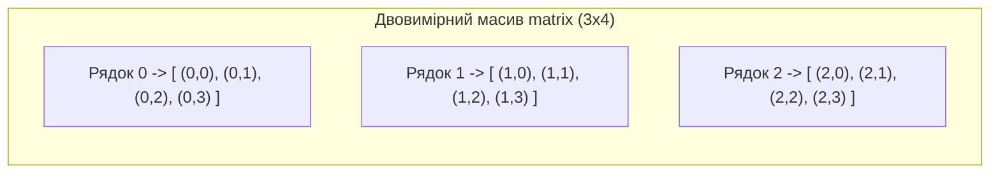
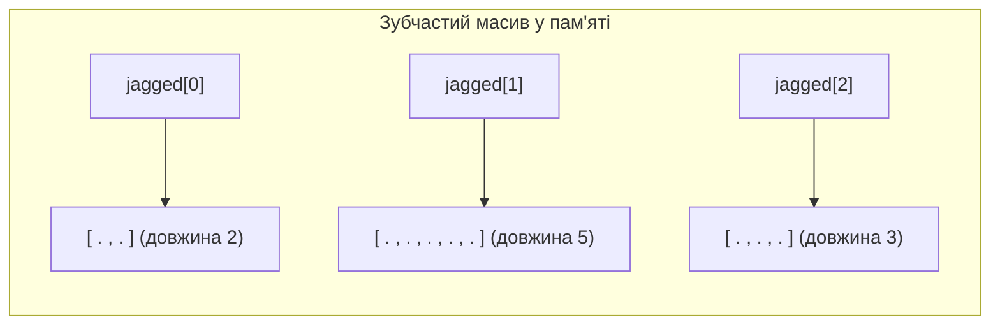

# Практична робота №5: Масиви в Java (Одновимірні, Двовимірні, Багатовимірні та Зубчасті)

## 🎯 Мета роботи
- **Опанувати фундаментальну структуру даних — масиви (Arrays):** зрозуміти призначення масивів, їхнє представлення як посилального типу даних та особливості розміщення в оперативній пам'яті комп'ютера (*Stack* vs *Heap*).
- **Засвоїти життєвий цикл масиву:** оголошення посилання, виділення суміжного блоку пам'яті оператором `new`, фіксованість розміру масиву після створення та значення елементів за замовчуванням (*default values*).
- **Опанувати механізм індексації:** нумерація елементів з нуля (`0` до `length - 1`), читання та модифікація значень за індексом, робота з властивістю `.length` та уникнення фатального винятку `ArrayIndexOutOfBoundsException`.
- **Вивчити способи обходу одновимірних масивів:**
  - Класичний цикл `for` із числовим індексом (для читання, запису, зворотного ходу та крокування).
  - Вдосконалений цикл `for-each` (для лаконічного та безпечного читання елементів).
- **Розвинути алгоритмічні навички роботи з одновимірними масивами:**
  - Накопичення суми та обчислення середнього арифметичного.
  - Пошук екстремальних значень ($\min$ та $\max$).
  - Лінійний пошук елемента, підрахунок кількості входжень та фільтрація.
  - Реверс (перевертання) масиву «на місці» (*in-place*) та безпечне копіювання.
- **Глибоко розібратися з двовимірними масивами (матрицями):** концепція «масив масивів», адресація через два індекси `[рядок][стовпчик]`, обхід за допомогою двох вкладених циклів `for`, обчислення сум рядків/стовпчиків, робота з головною та побічною діагоналями, транспонування.
- **Ознайомитися з зубчастими (jagged / ragged arrays) та багатовимірними масивами (3D+):** робота з масивами, де рядки мають різну довжину, та просторовими масивами кубічної структури.
- **Опанувати утилітарний клас `java.util.Arrays`:** швидке та красиве виведення (`Arrays.toString()`, `Arrays.deepToString()`), сортування (`Arrays.sort()`), масове заповнення (`Arrays.fill()`) та коректне порівняння (`Arrays.equals()`).
- **Розв'язати 40 практичних завдань:** закріпити матеріал на практиці, рухаючись від простих 1D та 2D прикладів до зубчастих масивів.

---

## 📚 1. Теоретичні відомості

### 1.1. Що таке масив? Концепція та пам'ять (Stack vs Heap)

У попередніх темах для збереження будь-якого значення ми створювали окрему змінну:
```java
int score1 = 95;
int score2 = 82;
int score3 = 90;
```
Якщо в групі навчається 30 студентів, а в банку обслуговується 10 000 клієнтів, створювати окрему змінну для кожного значення фізично неможливо.

> **Масив (Array)** — це впорядкована сукупність фіксованої кількості однотипних елементів, що зберігаються в пам'яті послідовно (в єдиному суцільному блоці) та мають одне спільне ім'я. Доступ до кожного елемента здійснюється за його порядковим номером — **індексом**.

#### Ключові властивості масивів у Java:
1. **Однотипність:** Усі елементи масиву обов'язково мають однаковий тип даних (наприклад, тільки `int`, тільки `double` або тільки `String`).
2. **Незмінність розміру (Fixed Size):** Кількість елементів масиву задається під час його створення й **не може бути змінена** в процесі роботи програми.
3. **Посилальний тип даних (Reference Type):** Сам масив завжди є об'єктом і розміщується в динамічній пам'яті (**Heap / Купа**), а змінна масиву є посиланням на нього і зберігається в швидкій пам'яті викликів (**Stack / Стек**).

```mermaid
flowchart LR
    subgraph Stack [Стек пам'яті (Stack)]
        ref["arr (посилання) 0x1A4F"]
    end
    subgraph Heap [Купа пам'яті (Heap)]
        subgraph ArrayObject ["Об'єкт int[4]"]
            i0["[0]: 10"]
            i1["[1]: 25"]
            i2["[2]: 40"]
            i3["[3]: 55"]
        end
    end
    ref --> ArrayObject
```

#### Значення за замовчуванням (Default values):
Коли ми виділяємо пам'ять під масив через ключове слово `new`, Java автоматично заповнює всі його комірки нульовими значеннями відповідно до типу:
- Числові типи (`byte`, `short`, `int`, `long`): `0`
- Дробові типи (`float`, `double`): `0.0`
- Логічний тип (`boolean`): `false`
- Символьний тип (`char`): `'\u0000'` (пустий символ / null-character)
- Посилальні типи (`String`, об'єкти): `null`

---

### 1.2. Одновимірні масиви: Оголошення, створення та ініціалізація

#### Спосіб 1: Оголошення та виділення пам'яті (з нульовими значеннями)
```java
// 1. Оголошення посилання на масив (тип[] назва)
int[] numbers;

// 2. Виділення пам'яті під 5 цілих чисел у Heap
numbers = new int[5]; // Тепер у масиві лежать: [0, 0, 0, 0, 0]

// Або в один рядок:
int[] scores = new int[5];
```

> [!TIP]
> У Java дозволено писати `int numbers[]`, як у мові C, проте стандартом чистого коду є `int[] numbers`, оскільки квадратні дужки відносяться до типу даних (масив цілих чисел), а не до назви змінної.

#### Спосіб 2: Ініціалізація значеннями (Масивний літерал)
Якщо значення відомі заздалегідь, масив можна оголосити та одразу наповнити даними за допомогою фігурних дужок `{}`:
```java
// Скорочений запис (масивний літерал)
int[] primes = {2, 3, 5, 7, 11};

// Повний запис (з явним зазначенням new int[])
String[] days = new String[]{"Пн", "Вт", "Ср", "Чт", "Пт", "Сб", "Нд"};
```

#### Довжина масиву: властивість `.length`
Кожен масив має вбудовану властивість `length`, яка повертає кількість його комірок:
```java
int[] array = new int[10];
System.out.println(array.length); // Виведе: 10
```
> [!IMPORTANT]
> Зверніть увагу: для масиву `length` — це **властивість (змінна)**, тому дужки `()` **не пишуться**! На відміну від рядків, де використовується метод `str.length()`.

---

### 1.3. Індексація та пастка `ArrayIndexOutOfBoundsException`

Індексація масивів у Java (як і в більшості мов) починається з нуля:
- **Перший елемент:** має індекс `0`.
- **Другий елемент:** має індекс `1`.
- **Останній елемент:** має індекс `array.length - 1`.

```java
int[] nums = {10, 20, 30, 40, 50}; // length = 5

System.out.println(nums[0]); // Перший елемент: 10
System.out.println(nums[nums.length - 1]); // Останній елемент: 50

// Модифікація комірки
nums[2] = 999; // Замість 30 тепер лежить 999
```

> [!CAUTION]
> Якщо звернутися до від'ємного індексу або індексу, який дорівнює або перевищує `length`, програма аварійно завершиться з критичною помилкою:
> `java.lang.ArrayIndexOutOfBoundsException: Index 5 out of bounds for length 5`
> 
> ```java
> int[] nums = {10, 20, 30, 40, 50};
> System.out.println(nums[5]); // ПОМИЛКА! Максимальний індекс тут 4.
> ```

---

### 1.4. Обхід одновимірних масивів: `for` проти `for-each`

#### 1. Класичний цикл `for` (ітерація за числовим індексом)
Використовується, коли:
- Потрібно знати порядковий номер (індекс) елемента.
- Потрібно **змінити** значення всередині масиву.
- Потрібно пройти масив у зворотному напрямку або з кроком, відмінним від 1.

```java
int[] numbers = {10, 20, 30, 40, 50};

for (int i = 0; i < numbers.length; i++) {
    System.out.println("Індекс " + i + " -> Значення: " + numbers[i]);
}
```

#### 2. Вдосконалений цикл `for-each` (ітерація за значеннями)
З'явився в Java 5 для швидкого читання всіх елементів колекції без ризику виходу за межі діапазону.

```java
int[] numbers = {10, 20, 30, 40, 50};

for (int num : numbers) {
    System.out.println("Значення: " + num);
}
```

> [!WARNING]
> Цикл `for-each` призначений **виключно для читання**! Змінна `num` є лише локальною копією значення. Якщо написати всередині циклу `num = 0;`, значення всередині масиву `numbers` **не зміняться**.

---

### 1.5. Базові алгоритми обробки одновимірних масивів

#### 1. Сума та середнє арифметичне
```java
int[] values = {5, 10, 15, 20, 25};
int sum = 0;

for (int val : values) {
    sum += val;
}

// Обов'язкове приведення (double) для точного результату
double average = (double) sum / values.length;
System.out.println("Сума: " + sum + ", Середнє: " + average);
```

#### 2. Пошук мінімального та максимального елементів
> [!IMPORTANT]
> Ніколи не ініціалізуйте `min` або `max` нулем! Якщо всі числа в масиві будуть від'ємними (наприклад, `{-5, -12, -3}`), ініціалізований нулем `max` видасть хибний результат `0`. Завжди беріть за початковий еталон перший елемент масиву: `int min = arr[0]; int max = arr[0];`.

```java
int[] temperatures = {-2, 5, 14, -8, 22, 10};

int min = temperatures[0];
int max = temperatures[0];

for (int i = 1; i < temperatures.length; i++) {
    if (temperatures[i] < min) {
        min = temperatures[i];
    }
    if (temperatures[i] > max) {
        max = temperatures[i];
    }
}
System.out.println("Мінімум: " + min + ", Максимум: " + max);
```

#### 3. Лінійний пошук елемента (Linear Search)
```java
int[] ids = {101, 205, 308, 412, 519};
int target = 308;
int foundIndex = -1;

for (int i = 0; i < ids.length; i++) {
    if (ids[i] == target) {
        foundIndex = i;
        break; // Знайшли! Немає сенсу шукати далі
    }
}

if (foundIndex != -1) {
    System.out.println("Елемент знайдено на позиції " + foundIndex);
} else {
    System.out.println("Елемент відсутній у масиві");
}
```

#### 4. Копіювання масивів: пастка посилань
```java
int[] a = {1, 2, 3};
int[] b = a; // НЕБЕЗПЕКА! Копіюється лише адреса посилання!

b[0] = 999;
System.out.println(a[0]); // Виведе 999! Масив a теж змінився!

// ПРАВИЛЬНЕ копіювання нового окремого масиву:
int[] realCopy = java.util.Arrays.copyOf(a, a.length);
```

---

### 1.6. Двовимірні масиви (Матриці)

У реальних програмах дані часто мають табличний вигляд: шахівниця, пікселі на екрані, таблиця оцінок студентів за предметами, місця в кінотеатрі.

> **Двовимірний масив (2D Array)** у Java — це «масив масивів», тобто масив, елементами якого є посилання на інші одновимірні масиви. Зазвичай його уявляють як таблицю (матрицю) з **рядків** та **стовпчиків**.



#### Оголошення та створення:
```java
// Створення матриці з 3 рядків та 4 стовпчиків
int[][] matrix = new int[3][4];

// Розміри:
int rows = matrix.length;       // Кількість рядків (3)
int cols = matrix[0].length;    // Кількість стовпчиків у нульовому рядку (4)

// Доступ до комірки: matrix[рядок][стовпчик]
matrix[0][0] = 5;  // Лівий верхній кут
matrix[2][3] = 42; // Правий нижній кут
```

#### Ініціалізація літералом:
```java
int[][] grid = {
    {1, 2, 3},
    {4, 5, 6},
    {7, 8, 9}
};
```

#### Обхід двовимірного масиву за допомогою двох вкладених циклів `for`:
```java
for (int row = 0; row < grid.length; row++) {
    for (int col = 0; col < grid[row].length; col++) {
        System.out.print(grid[row][col] + "\t");
    }
    System.out.println(); // Перехід на новий рядок після виведення всього рядка таблиці
}
```

---

### 1.7. Зубчасті (Jagged) та багатовимірні масиви (3D+)

#### Зубчасті (ступінчасті) масиви (Jagged / Ragged Arrays)
Оскільки в Java двовимірний масив — це масив посилань на незалежні одновимірні масиви, **кожен рядок може мати свою унікальну довжину**!

```java
// Створюємо масив із 3 рядків, але довжину стовпчиків не вказуємо:
int[][] jagged = new int[3][];

// Виділяємо пам'ять під кожен рядок окремо:
jagged[0] = new int[2]; // 1-й рядок має 2 комірки
jagged[1] = new int[5]; // 2-й рядок має 5 комірок
jagged[2] = new int[3]; // 3-й рядок має 3 комірки
```



#### Багатовимірні масиви (3D+)
Масив може мати 3 і більше вимірів. Наприклад, тривимірний масив $3 \times 3 \times 3$ можна уявити як куб даних або книгу з кількома сторінками, де кожна сторінка є двовимірною таблицею:
```java
// [сторінка / зріз][рядок][стовпчик]
int[][][] cube = new int[3][3][3];

cube[0][1][2] = 77; // Шар 0, рядок 1, стовпчик 2
```

---

### 1.8. Клас `java.util.Arrays` — незамінний помічник

Клас `Arrays` містить готові статичні методи для типових дій з масивами:

| Метод | Опис | Приклад використання |
| :--- | :--- | :--- |
| `Arrays.toString(arr)` | Перетворює 1D масив у красивий рядок вигляду `[1, 2, 3]` | `System.out.println(Arrays.toString(numbers));` |
| `Arrays.deepToString(m)`| Перетворює 2D і багатовимірні масиви у рядок `[[1, 2], [3, 4]]` | `System.out.println(Arrays.deepToString(matrix));` |
| `Arrays.sort(arr)` | Сортує елементи масиву за зростанням | `Arrays.sort(numbers);` |
| `Arrays.fill(arr, val)` | Заповнює весь масив однаковим значенням | `Arrays.fill(scores, 100);` |
| `Arrays.equals(a, b)` | Порівнює вміст двох 1D масивів (поелементно) | `boolean eq = Arrays.equals(a, b);` |
| `Arrays.copyOf(arr, len)`| Створює незалежний дублікат масиву вказаної довжини | `int[] copy = Arrays.copyOf(arr, arr.length);` |

---

### 1.9. Q&A (Часті запитання на співбесідах)

#### Q1: Чому масив не можна розширити після створення?
Пам'ять під масив у купі виділяється єдиним суцільним неперервним шматком. Якщо спробувати розширити його на місці, наступні адреси пам'яті вже можуть бути зайняті іншими об'єктами програми. Щоб змінити розмір, створюють новий масив більшого розміру і копіюють туди елементи зі старого.

#### Q2: Чому `System.out.println(arr)` виводить щось схоже на `[I@5f184fc6`?
Масив у Java успадковує стандартний метод `toString()` від класу `Object`, який виводить сигнатуру типу (`[I` означає одновимірний масив цілих чисел `int`) та шістнадцятковий хеш-код об'єкта. Щоб надрукувати самі дані, використовуйте `Arrays.toString(arr)`.

#### Q3: У чому різниця між `==` та `Arrays.equals()` для масивів?
Оператор `a == b` перевіряє, чи вказують дві змінні на **один і той самий об'єкт у пам'яті** (порівнює посилання). Метод `Arrays.equals(a, b)` порівнює **вміст** масивів — кількість елементів та їхні значення.

---

## 💻 2. Практичні завдання (40 завдань)

Виконуйте завдання всередині класу `Practice05`. Усі завдання побудовані за принципом поступового нарощування складності: від базових операцій із одновимірними масивами до алгоритмів на матрицях та перших кроків у зубчастих масивах.

---

### Блок 1: Оголошення, ініціалізація та доступ до 1D-масивів (Завдання 1–7)

#### Завдання 1: Перший масив та значення за замовчуванням
Створіть масив цілих чисел `int[] numbers = new int[5];`.
1. За допомогою класичного циклу `for` виведіть усі його елементи в один рядок, щоб переконатися, що Java за замовчуванням заповнила його нулями.
2. Присвойте першому елементу значення `10`, третьому — `30`, а останньому — `50`.
3. Виведіть масив знову через `Arrays.toString(numbers)`.

#### Завдання 2: Рядковий масив днів тижня
Оголосіть масив рядків `String[] days` за допомогою масивного літералу `{...}`, що містить назви 7 днів тижня (від `"Понеділок"` до `"Неділя"`).
1. Виведіть загальну кількість днів за допомогою властивості `.length`.
2. Виведіть назву першого дня (`індекс 0`) та останнього дня (`індекс length - 1`).
3. Замініть значення для суботи та неділі на `"Вихідний (Сб)"` та `"Вихідний (Нд)"` і виведіть увесь список днів.

#### Завдання 3: Модифікація цін на складі
Створіть масив цін 5 товарів: `double[] prices = {120.50, 45.00, 890.99, 15.30, 420.00};`.
1. Виведіть початковий стан масиву.
2. Клієнту надали знижку 20% на найдорожчий товар (елемент з індексом 2). Модифікуйте цей елемент за формулою: `prices[2] = prices[2] * 0.8;`.
3. Виведіть оновлений масив цін.

#### Завдання 4: Заповнення масиву числами від 1 до N
Зчитайте з консолі ціле число $N$ ($N > 0$). Створіть масив розміром $N$. За допомогою циклу `for` заповніть його послідовними числами від $1$ до $N$ (так, щоб `arr[0] = 1, arr[1] = 2, ..., arr[N-1] = N`). Виведіть отриманий масив у консоль.

#### Завдання 5: Зворотний вивід масиву
Створіть масив із 6 цілих чисел (наприклад: `{4, 8, 15, 16, 23, 42}`). За допомогою циклу `for`, лічильник якого починається з `arr.length - 1` і зменшується до `0`, виведіть елементи масиву у зворотному порядку через кому.

#### Завдання 6: Масив степенів двійки
Створіть масив цілих чисел розміром 10. За допомогою циклу `for` заповніть його першими 10 степенями двійки: $2^0, 2^1, 2^2, \dots, 2^9$ ($1, 2, 4, 8, 16, 32, 64, 128, 256, 512$). Розрахунок проводьте без використання `Math.pow`, множачи попередній елемент на 2.

#### Завдання 7: Ручне копіювання елементів
Створіть масив `int[] original = {3, 7, 1, 9, 4};`. Створіть другий масив `int[] copy` такого ж розміру. За допомогою циклу `for` поелементно скопіюйте всі значення з `original` у `copy`. Змініть перший елемент у `copy` на `999` і виведіть обидва масиви, щоб продемонструвати, що вони незалежні.

---

### Блок 2: Базові обчислення та агрегація в 1D-масивах (Завдання 8–15)

#### Завдання 8: Загальна сума та середній бал
Дано масив оцінок студента: `int[] grades = {95, 84, 70, 99, 65, 88, 92};`.
1. За допомогою циклу знайдіть суму всіх оцінок.
2. Порахуйте середній бал як точне дробове число `double` (із приведенням типів).
3. Виведіть результат у консоль: `Сума: ..., Середній бал: ...`.

#### Завдання 9: Пошук мінімальної та максимальної температури
Дано масив щоденних температур за тиждень: `int[] temps = {18, 21, 15, 24, 13, 27, 20};`.
1. Знайдіть мінімальну та максимальну температуру тижня.
2. **Вимога:** ініціалізуйте змінні `min` та `max` значенням `temps[0]`.
3. Виведіть знайдені значення та їхні індекси (дні тижня).

#### Завдання 10: Лічильник додатних, від'ємних та нульових чисел
Створіть масив чисел: `int[] data = {12, -5, 0, 43, -19, 0, -2, 8, 0, 15};`.
За один прохід циклом підрахуйте:
1. Кількість строго додатних елементів ($> 0$).
2. Кількість від'ємних елементів ($< 0$).
3. Кількість нульових значень ($== 0$).

#### Завдання 11: Парні та непарні елементи
Створіть масив із 10 випадкових або заданих цілих чисел.
1. Підрахуйте кількість парних чисел у масиві.
2. Підрахуйте окремо суму всіх непарних чисел.
3. Виведіть статистику.

#### Завдання 12: Лінійний пошук елемента
Дано масив номерів залікових книжок: `int[] students = {1042, 2031, 3055, 4018, 5099};`.
Запитайте у користувача шуканий номер. За допомогою циклу знайдіть його індекс у масиві. Якщо номер знайдено — виведіть його позицію і негайно завершіть пошук через `break`. Якщо такий номер відсутній — виведіть повідомлення: `"Студента з таким номером не знайдено"`.

#### Завдання 13: Підрахунок кількості входжень
Створіть масив `int[] rolls = {3, 6, 2, 6, 1, 4, 6, 5, 2, 6};` (результати 10 кидків кубика).
Запитайте у користувача число від 1 до 6. За допомогою циклу порахуйте, скільки разів це число випало серед результатів.

#### Завдання 14: Фільтрація: елементи, більші за середнє
Дано масив зарплат співробітників відділу: `{18000, 25000, 32000, 15000, 41000, 29000}`.
1. Обчисліть середню зарплату у відділі.
2. Пройдіть по масиву вдруге і виведіть лише ті зарплати, які строго перевищують середній показник.

#### Завдання 15: Розмах значень (амплітуда)
Дано масив котирувань акцій за робочий день: `double[] prices = {42.5, 41.8, 44.1, 40.9, 43.6, 45.0};`.
Знайдіть різницю між максимальною та мінімальною ціною (розмах коливань цін) і виведіть її з точністю до двох знаків після коми.

---

### Блок 3: Перетворення, for-each та клас Arrays (Завдання 16–22)

#### Завдання 16: Безпечний обхід через `for-each`
Створіть масив рядків із 5 міст України: `{"Київ", "Львів", "Харків", "Одеса", "Дніпро"}`.
За допомогою вдосконаленого циклу `for-each` виведіть привітання для кожного міста у форматі: `Ласкаво просимо до міста [Назва]!`.

#### Завдання 17: Індексація значень (збільшення на відсоток)
Створіть масив `double[] salaries = {20000.0, 25000.0, 18000.0, 30000.0};`.
За допомогою класичного циклу `for` збільшіть значення кожного елемента на 10% (`salaries[i] *= 1.10;`). Виведіть оновлений масив за допомогою `Arrays.toString()`.

#### Завдання 18: Реверс масиву «на місці» (In-place Reverse)
Створіть масив `int[] arr = {1, 2, 3, 4, 5, 6};`.
Переверніть його елементи у зворотному порядку, **не створюючи новий масив**.
*Підказка:* міняйте місцями елементи `arr[i]` та `arr[arr.length - 1 - i]` за допомогою тимчасової змінної `temp`, виконуючи цикл лише до половини довжини `i < arr.length / 2`.

#### Завдання 19: Масив квадратів
Дано вхідний масив: `int[] base = {2, 4, 6, 8, 10};`.
Створіть новий масив `squares` такої ж довжини. Заповніть його квадратами відповідних чисел з масиву `base`. Виведіть обидва масиви у консоль.

#### Завдання 20: Перевірка відсортованості масиву
Створіть масив цілих чисел. Напишіть алгоритм перевірки, чи впорядкований масив за зростанням (тобто чи виконується умова `arr[i] <= arr[i + 1]` для всіх пар). Використайте змінну-прапорець `boolean isSorted = true;`. Якщо знайдено порушення — встановіть `isSorted = false` та зробіть `break`.

#### Завдання 21: Об'єднання двох масивів (Concatenation)
Дано два масиви: `int[] a = {1, 2, 3};` та `int[] b = {4, 5, 6, 7};`.
Створіть новий третій масив `c` довжиною `a.length + b.length`. За допомогою двох послідовних циклів скопіюйте спочатку всі елементи `a`, а потім усі елементи `b`. Виведіть результуючий масив.

#### Завдання 22: Тріо утиліт: `toString`, `sort`, `fill`
Створіть масив `int[] test = {45, 12, 89, 3, 27};`.
1. Виведіть його початковий стан через `Arrays.toString(test)`.
2. Відсортуйте масив за зростанням за допомогою `Arrays.sort(test)` і виведіть знову.
3. Заповніть увесь масив числом `-1` за допомогою `Arrays.fill(test, -1)` і виведіть фінальний результат.

---

### Блок 4: Двовимірні масиви (Матриці): структура та виведення (Завдання 23–29)

#### Завдання 23: Перша таблиця $3 \times 3$
Створіть квадратну матрицю `int[][] table = new int[3][3];`.
Заповніть будь-якими власними числами і виведіть її на екран за допомогою двох вкладених циклів `for` у вигляді рівної сітки, розділяючи елементи символом табуляції `\t`.

#### Завдання 24: Розміри прямокутної матриці
Оголосіть прямокутну матрицю літералом:
```java
int[][] matrix = {
    {10, 20, 30, 40},
    {50, 60, 70, 80}
};
```
1. Виведіть кількість рядків матриці (`matrix.length`).
2. Виведіть кількість стовпчиків у першому рядку (`matrix[0].length`).
3. Виведіть значення кутових елементів: лівий верхній, правий верхній, лівий нижній, правий нижній.

#### Завдання 25: Заповнення матриці порядковими числами
Створіть масив `int[][] grid = new int[3][4];` (3 рядки, 4 стовпчики).
За допомогою двох вкладених циклів та спільного лічильника `int counter = 1;` заповніть масив послідовними числами від 1 до 12. Виведіть таблицю в консоль.

#### Завдання 26: Випадкова матриця та `deepToString`
Створіть матрицю `int[][] randomGrid = new int[4][3];`. Заповніть усі комірки випадковими числами від 10 до 99 (`(int)(Math.random() * 90) + 10`). Виведіть масив двома способами:
1. За допомогою одного виклику `Arrays.deepToString(randomGrid)`.
2. За допомогою вкладених циклів у вигляді таблиці.

#### Завдання 27: Таблиця множення Піфагора у 2D-масиві
Створіть масив `int[][] multTable = new int[9][9];`.
Заповніть його таблицею множення чисел від 1 до 9 так, щоб у комірці `[i][j]` зберігався добуток `(i + 1) * (j + 1)`. Виведіть таблицю з красивим вирівнюванням стовпчиків.

#### Завдання 28: Одинична матриця (Identity Matrix)
Створіть квадратну матрицю $5 \times 5$. Заповніть її так, щоб на головній діагоналі (де індекс рядка збігається з індексом стовпчика: `row == col`) стояли одиниці `1`, а в усіх інших клітинках — нулі `0`. Виведіть матрицю на екран.

#### Завдання 29: Модифікація рядка та стовпчика
Створіть матрицю $4 \times 4$, заповнену одиницями.
1. Зануліть увесь другий рядок (`рядок з індексом 1`).
2. Заповніть третій стовпчик (`стовпчик з індексом 2`) числом `7`.
3. Виведіть модифіковану матрицю.

---

### Блок 5: Обчислення та алгоритми в двовимірних масивах (Завдання 30–35)

#### Завдання 30: Сума та середнє значення елементів матриці
Дано матрицю $3 \times 3$ із довільними числами.
За допомогою двох вкладених циклів порахуйте:
1. Загальну суму всіх чисел у матриці.
2. Загальну кількість елементів ($rows \times cols$).
3. Середнє арифметичне значення всієї матриці у форматі `double`.

#### Завдання 31: Сума кожного рядка окремо
Дано двовимірний масив $3 \times 4$. Для кожного рядка окремо порахуйте суму його елементів і збережіть у 1D-масив `int[] rowSums = new int[3];`. Виведіть суми: `Рядок 0: сума = ..., Рядок 1: сума = ...`.

#### Завдання 32: Сума кожного стовпчика
Дано матрицю $3 \times 3$. Напишіть вкладені цикли, у яких зовнішній цикл перебирає стовпчики (`col`), а внутрішній — рядки (`row`). Порахуйте суму чисел у кожному стовпчику окремо та надрукуйте підсумковий рядок сум під матрицею.

#### Завдання 33: Пошук глобального екстремуму в матриці
Створіть матрицю $3 \times 4$ з різними додатними та від'ємними числами.
Знайдіть максимальний елемент у всій таблиці, а також збережіть його координати — номер рядка та номер стовпчика, де він знаходиться: `Максимум: X у комірці [row, col]`.

#### Завдання 34: Сума головної та побічної діагоналей
Дано квадратну матрицю $4 \times 4$.
1. Порахуйте суму елементів **головної діагоналі** (де `row == col`).
2. Порахуйте суму елементів **побічної діагоналі** (де `row + col == matrix.length - 1`).
3. Порівняйте ці дві суми між собою.

#### Завдання 35: Транспонування квадратної матриці
Дано квадратну матрицю $3 \times 3$.
Створіть нову матрицю `transposed` такого ж розміру. Заповніть її так, щоб рядки початкової матриці стали стовпчиками нової (`transposed[j][i] = matrix[i][j];`). Виведіть початкову та транспоновану матриці поруч для порівняння.

---

### Блок 6: Зубчасті та багатовимірні масиви (Завдання 36–40)

#### Завдання 36: Ступінчастий (зубчастий) масив-сходинки
Створіть зубчастий масив `int[][] ladder = new int[4][];`.
1. Виділіть для нульового рядка 1 елемент, для першого — 2, для другого — 3, для третього — 4 елементи.
2. Заповніть кожен рядок числом, що дорівнює порядковому номеру його рядка (`0`, `1`, `2`, `3`).
3. Виведіть масив у формі сходинок.

#### Завдання 37: Розклад навчальних занять на тиждень
Створіть зубчастий масив рядків `String[][] weekSchedule = new String[5][];` для 5 робочих днів:
- Понеділок: 3 пари (`{"Вища математика", "Основи програмування", "Фізика"}`)
- Вівторок: 2 пари (`{"Англійська мова", "Історія України"}`)
- Середа: 4 пари (`{"Основи програмування", "Основи програмування", "Бази даних", "Фізвиховання"}`)
- Четвер: 1 пара (`{"Дискретна математика"}`)
- П'ятниця: 3 пари (`{"Філософія", "Основи алгоритмізації", "Практикум"}`)

Виведіть розклад у консоль із зазначенням дня тижня та кількості пар у цей день (`weekSchedule[i].length`).

#### Завдання 38: Трикутник Паскаля (перші 5 рядків)
Створіть зубчастий масив `int[][] pascal = new int[5][];`.
Кожен рядок $i$ має довжину $i + 1$.
- Перший і останній елемент кожного рядка дорівнюють `1`.
- Будь-який проміжний елемент обчислюється як сума двох елементів над ним із попереднього рядка:
  `pascal[i][j] = pascal[i - 1][j - 1] + pascal[i - 1][j];`
Обчисліть та виведіть перші 5 рядків знаменитого трикутника Паскаля!

#### Завдання 39: Тривимірний масив: Просторова сітка $3 \times 3 \times 3$
Створіть тривимірний масив `int[][][] cube = new int[3][3][3];`.
Заповніть його значеннями так, щоб у кожній комірці лежала сума її індексів: `cube[x][y][z] = x + y + z;`.
За допомогою трьох вкладених циклів виведіть зрізи куба по шарах (по площинах `x = 0`, `x = 1`, `x = 2`), відокремлюючи кожен шар заголовком: `--- Шар X ---`.

#### Завдання 40: Метеорологічний куб (3 міста $\times$ 7 днів $\times$ 2 заміри)
Створіть тривимірний масив `double[][][] weather = new double[3][7][2];`, де:
- 1-й вимір (розмір 3) — це 3 міста: Київ, Львів, Одеса;
- 2-й вимір (розмір 7) — 7 днів тижня;
- 3-й вимір (розмір 2) — 2 заміри температури: `[0]` — день, `[1]` — ніч.

Заповніть масив правдоподібними температурами. За допомогою циклів порахуйте та виведіть:
1. Середню денну температуру по кожному з 3 міст за тиждень.
2. Найхолоднішу ніч серед усіх трьох міст за весь тиждень.

---

## 🚀 Поради щодо виконання та налагодження коду

1. **Контролюйте межі масиву:** Пам'ятайте, що останній доступний індекс — це завжди `length - 1`. Не використовуйте умову `<= arr.length` у циклах; пишіть строго `< arr.length`.
2. **Перевіряйте масив через `Arrays.toString()`:** Якщо вам потрібно швидко глянути, що лежить у масиві під час виконання завдання, використовуйте `System.out.println(Arrays.toString(arr));` замість написання окремого циклу виведення.
3. **Для двовимірних масивів — `Arrays.deepToString()`:** Для швидкого перегляду матриць або зубчастих масивів чудово підходить `Arrays.deepToString(matrix)`.
4. **Не забувайте про вкладені цикли:** При обході матриці зовнішній цикл відповідає за рядки (`row`), а внутрішній — за стовпчики (`col`). Завжди перевіряйте довжину конкретного рядка через `matrix[row].length`.
